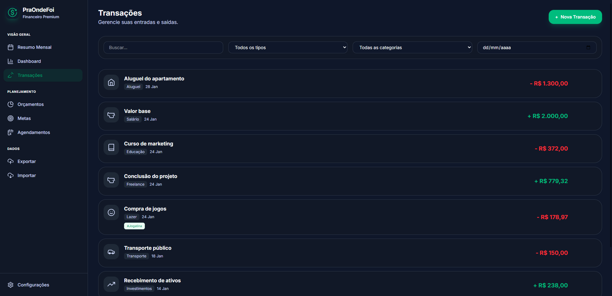
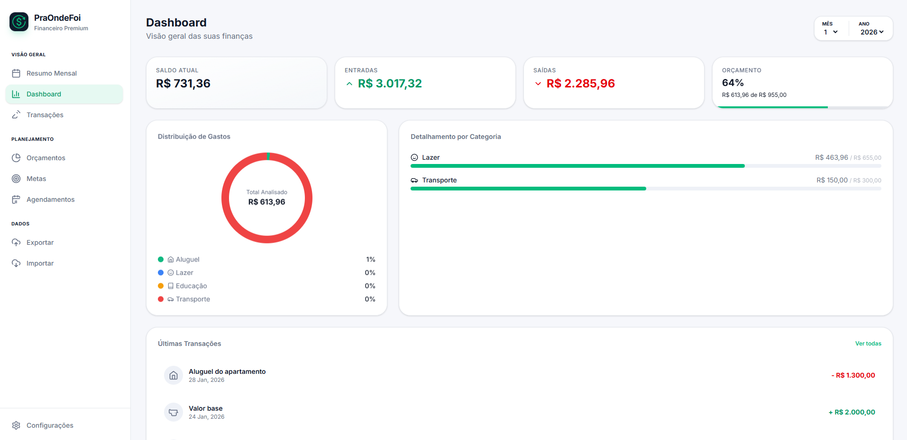
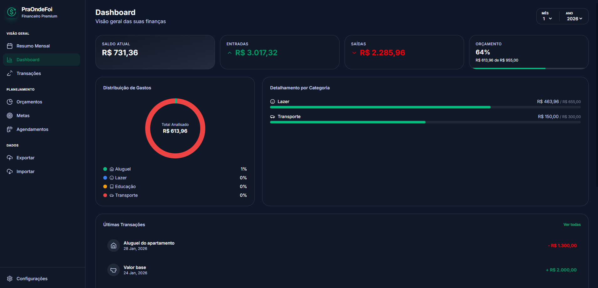
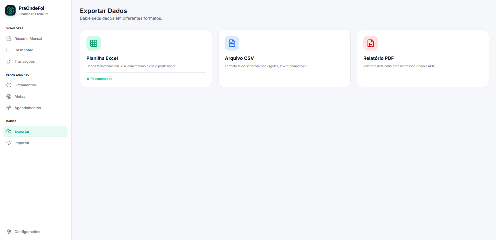

# PraOndeFoi

**Para onde foi o seu dinheiro? Descubra com o PraOndeFoi.**

O PraOndeFoi é uma aplicação moderna de controle financeiro projetada para lhe dar controle total sobre suas finanças. Pare de se perguntar para onde foi seu dinheiro suado e comece a direcioná-lo para seus objetivos. Com uma interface elegante e recursos poderosos, a clareza financeira está a apenas um clique de distância.




## Por que PraOndeFoi?

Gerenciar finanças não deveria ser uma tarefa árdua. O PraOndeFoi transforma a tarefa tediosa de rastrear despesas em uma experiência esclarecedora.

- **Clareza:** Visualize sua saúde financeira instantaneamente.
- **Controle:** Defina orçamentos e acompanhe-os em tempo real.
- **Crescimento:** Defina metas e acompanhe seu progresso.

## Principais Recursos

### 1. Dashboard Interativo
Tenha uma visão geral de alto nível de suas finanças. Veja suas receitas, despesas e saldo num piscar de olhos.




### 2. Rastreamento Inteligente de Transações
Registre transações rapidamente e categorize-as sem esforço. Filtre, pesquise e analise seus hábitos de consumo.

### 3. Metas
Sonhe alto e planeje para isso. Defina metas financeiras, acompanhe seu progresso e mantenha-se motivado.

### 4. Orçamentos
Crie orçamentos para diferentes categorias. Receba alertas quando estiver perto de seus limites e ajuste seus gastos antes que seja tarde demais.

### 5. Importações e Exportações Perfeitas
Seus dados pertencem a você. Importe facilmente extratos bancários e exporte seus relatórios para análise offline.



## Começando

### Pré-requisitos
- Node.js
- NPM
- Angular CLI

### Instalação

1. Clone o repositório:
   ```bash
   git clone https://github.com/Xcode-sketcher/IPraOndeFoi
   ```
2. Navegue até o diretório do projeto:
   ```bash
   cd praondefoi
   ```
3. Instale as dependências:
   ```bash
   npm install
   ```
4. Inicie o servidor de desenvolvimento:
   ```bash
   ng serve
   ```
5. Configure o back end seguindo os passos do seguinte repositório:
    https://github.com/Xcode-sketcher/PraOndeFoi

## Tecnologias Utilizadas

Construído com tecnologias de ponta para desempenho e escalabilidade.

- **Angular v21:** Para uma interface de usuário responsiva e dinâmica.
- **Tailwind CSS:** Para um design moderno e personalizado sem excessos.
- **TypeScript:** Para um código robusto e de fácil manutenção.

## Licença

Este projeto está licenciado sob a Licença MIT.
